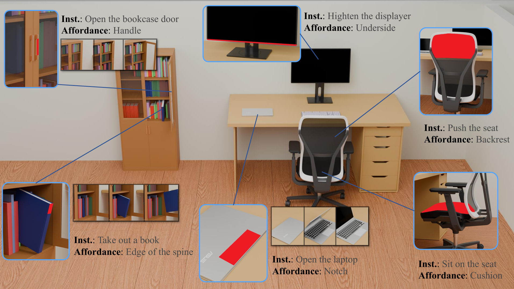

<div align="center">
    <h1>  From Parts to Patches: Fine-Grained Affordance Grounding for 3D Assets Physics-Aware Interaction </h1>
    <a href="https://huggingface.co/mexdyf/Sim-3DAfford" target="_blank">
      
    </a> 
    <a href="https://huggingface.co/datasets/mexdyf/3DAffordData" target="_blank">
    	
    </a>
</div>



Sim-3DAfford is a novel framework designed to bridge the "interaction granularity gap" in 3D asset generation. While current methods focus on part-level articulation, they often fail to identify the specific localized regions where interactions actually occur.

Our framework generates **simulation-ready 3D assets** from a **single image and an interaction instruction**. Unlike existing methods, Sim-3DAfford predicts:

1. **Structured Physical Attributes**: Real-world physical properties for simulation.
2. **Articulated Geometry**: Precise 3D structures with movable parts.
3. **Fine-Grained Affordance Patches**: Explicitly localized surface regions (contact priors) that are physically actionable.

By unifying these representations, Sim-3DAfford enables 3D assets to be directly imported into physics engines for downstream robotic manipulation tasks with unprecedented precision

## Installation

Run the installation script:

```
. ./setup.sh --new-env --basic --xformers --flash-attn --diffoctreerast --spconv --mipgaussian --kaolin --nvdiffrast
```

## Dataset

Download the dataset `3DAffordData` and unzip to `./dataset`:

```
hf download mexdyf/3DAffordData \
  --repo-type dataset \
  --pattern "Selected_20260127_110943.7z.*" \
  --local-dir .
mkdir dataset
7z x Selected_20260127_110943.7z.001 -o dataset
```

## Inference

Download the pre-train model from huggingface:

```
python script/download.py
```

Run the generating inference code:

```
python inference/1_vlm_demo.py
python inference/2_decoder.py
python inference/3_split.py
python inference/5_simready_gen.py
```

Run affordance inference on one image:

```
python inference/4_affordance.py \
  --image_path ./example/0.png \
  --query "grasp" \
  --save_output ./test_demo/0/affordance.txt
```

## Training

Run training with:

```
chmod +x train.sh
./train.sh
```